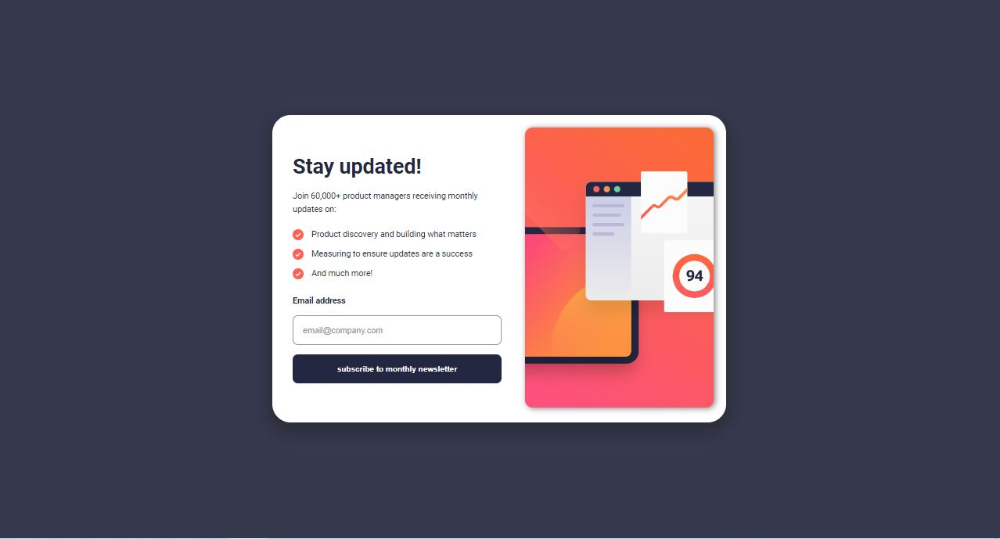

<h1 align="center">Newsletter Signup Form
</h1>

 

   <a href="https://ahlam-alsaffarini.github.io/FAQ/"> Demo 🔥🤍</a>

   Solution for a challenge from  <a href="https://www.frontendmentor.io/challenges/newsletter-signup-form-with-success-message-3FC1AZbNrv" target="_blank">frontendmentor.io</a>.

 
 

## Overview

### The challenge

This a challenge is to build out this newsletter form and get it looking as close to the design as possible.

- Add their email and submit the form
- See a success message with their email after successfully submitting the form
- See form validation messages if:
  - The field is left empty
  - The email address is not formatted correctly
- View the optimal layout for the interface depending on their device's screen size
- See hover and focus states for all interactive elements on the page

## My process

### Built with

- Semantic HTML5 markup
- CSS custom properties
- Flexbox
- Mobile-first workflow

### What I learned

i start to learn more then before in animation, and how to avoid submit of invalid email
this was a great challenge for me <3

### Useful resources

- [MDN](https://developer.mozilla.org/en-US/)
- [stackoverflow](https://stackoverflow.com/)

## Acknowledgments

A big thank you to anyone providing feedback on my . It definitely helps to find new ways to code and find easier solutions!
